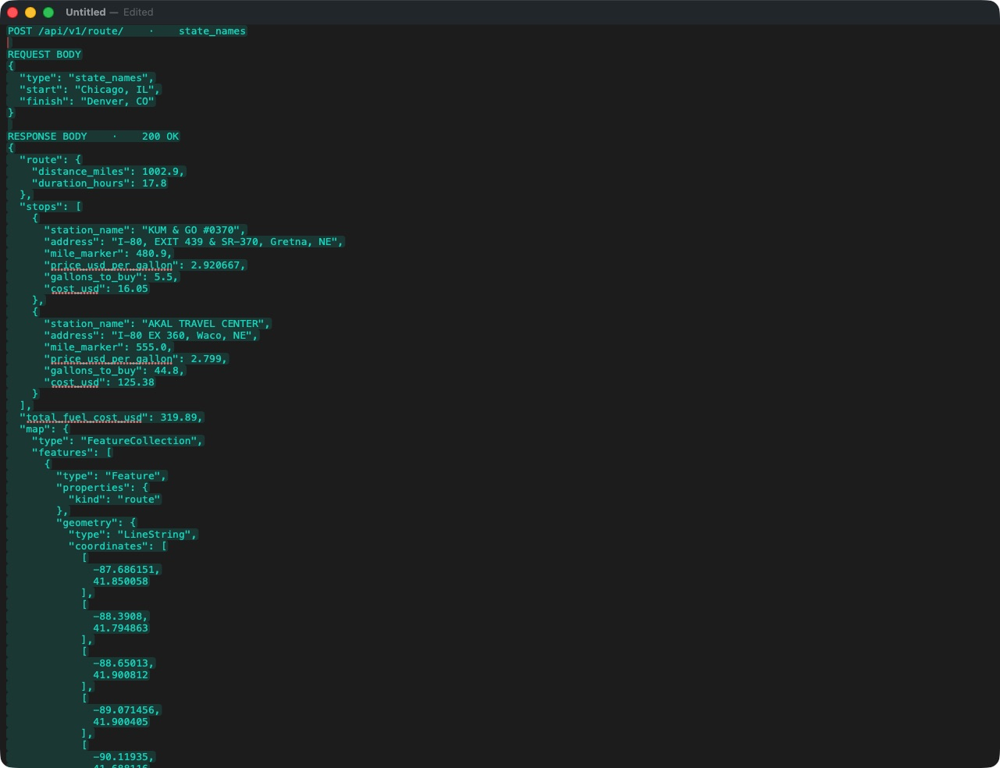
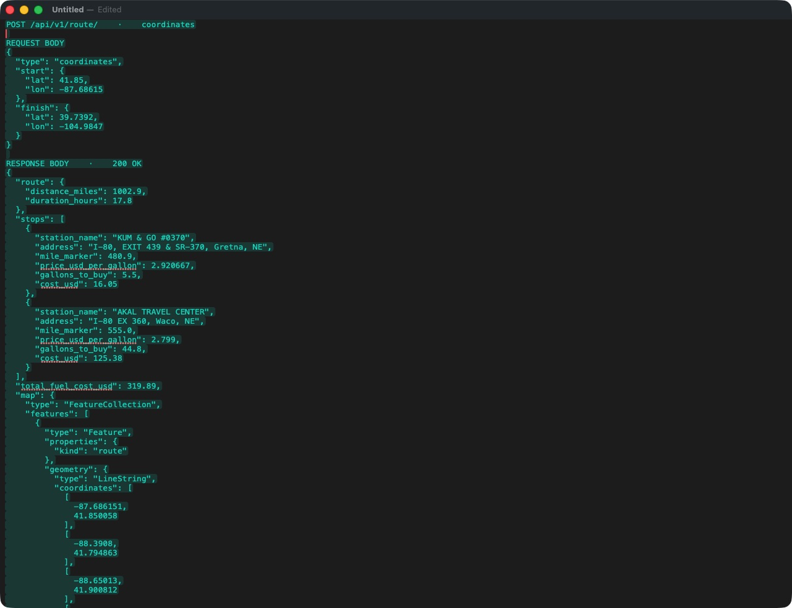
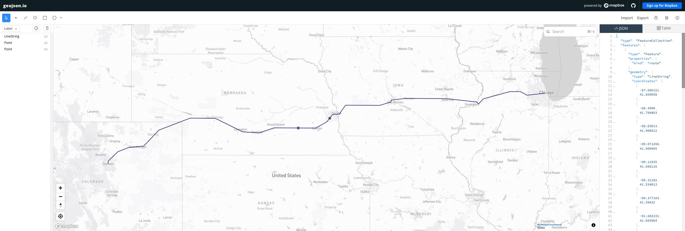

# Fuel Route Optimizer

A Django 6.1 API that returns a US driving route, recommended fuel purchases along it, a GeoJSON map, and an estimated total trip fuel cost. It uses the supplied truckstop price CSV. For each new route it makes **one** request to the free [OSRM routing API](https://project-osrm.org/), then evaluates the fuel prices locally. Repeated routes are cached for 24 hours per application process.

## Run locally

Python 3.12 or newer is recommended.

```bash
python3 -m venv .venv
.venv/bin/python -m pip install -r requirements.txt
.venv/bin/python manage.py runserver
```

No API key or database migration is needed. The included station catalog is generated from the assessment CSV and GeoNames postal location data.

## Request

```bash
curl -sS http://127.0.0.1:8000/api/v1/route/ \
  -H 'Content-Type: application/json' \
  -d '{"type":"state_names","start":"Chicago, IL","finish":"Denver, CO"}'
```

For coordinates, set `type` to `"coordinates"` and provide both locations as latitude/longitude objects:

```bash
curl -sS http://127.0.0.1:8000/api/v1/route/ \
  -H 'Content-Type: application/json' \
  -d '{"type":"coordinates","start":{"lat":41.8781,"lon":-87.6298},"finish":{"lat":39.7392,"lon":-104.9903}}'
```

`type` is required. With `"state_names"`, `start` and `finish` must each be a US `"City, ST"` string; city names are resolved locally without a geocoding call. With `"coordinates"`, they must each be an object with numeric `lat` and `lon` inside the USA. Coordinates are checked against offline US Census state boundaries. The optional `initial_fuel_gallons` field is between 0 and 50 and defaults to **50**, meaning a full tank at the start.

The response is formatted with indentation and has four top-level fields:

| Field | Meaning |
| --- | --- |
| `route` | Driving distance in miles and estimated duration in hours. |
| `stops` | Ordered fuel stops. Each has a station name, full address, route mile marker, price per gallon, gallons to buy, and purchase cost. |
| `total_fuel_cost_usd` | Estimated value of all fuel **consumed** on the trip, including fuel already in the tank at departure. |
| `map` | GeoJSON FeatureCollection containing the route line and numbered fuel stop markers. |

The price of starting fuel is estimated using the nearest listed station. Station map markers are projected from city-level estimates onto the route; they are not exact pump coordinates. The detailed assumptions and source attribution are documented below rather than repeated in every API response.

For example, to save a route map for a GeoJSON viewer:

```bash
curl -sS http://127.0.0.1:8000/api/v1/route/ \
  -H 'Content-Type: application/json' \
  -d '{"type":"state_names","start":"Chicago, IL","finish":"Denver, CO"}' \
  | python3 -c 'import json,sys; json.dump(json.load(sys.stdin)["map"], open("route-map.geojson", "w"))'
```

`GET /health/` provides a simple health check. Invalid inputs return HTTP 400, unavailable/no route responses return 502, and routes that cannot be driven within the tank range using known stops return 422.

## Screenshots

Both requests below calculate the same Chicago–Denver trip. The response includes the route summary, fuel stops, total fuel cost, and a GeoJSON map.

### City and state names



### Coordinates



### Route on geojson.io

The response's `map` field displays the route line and two fuel stop markers in [geojson.io](https://geojson.io/).



## How the plan works

The CSV contains no latitude or longitude, so a prebuilt offline catalog locates each station using its **city's GeoNames postal coordinate estimate**. The route is requested once from OSRM. A small spatial index projects city estimates onto the route and keeps stations within 15 straight-line miles of it. At each estimated route position, the cheapest listed station is considered.

Tank capacity is 50 gallons because the vehicle travels 500 miles at 10 mpg. For the fixed route and candidate positions, the planner buys enough to reach the next station with an equal or lower price when it lies within range. Otherwise, it fills only as much as the remaining trip needs. This minimizes purchase cost under those assumptions. The response also reports a fuel cost for the full trip by valuing consumed starting fuel at the nearest listed station's price. It uses a first-in, first-out accounting convention for fuel already in the tank and later purchases.

The algorithm has no per-stop inconvenience cost. On a long route, it may recommend several small purchases to save money. The API does not reroute through fuel stops; doing so would require additional routing calls and exact station coordinates that the CSV lacks.

## Data accuracy and limits

- Station coordinates are **city-level estimates**, not pump locations. A fuel stop marker in the GeoJSON map is where the city estimate projects onto the route. The actual exit, access road, and detour may differ.
- The 15 mile corridor is a straight-line approximation. Detour time and fuel, tolls, road access, and changing fuel prices are not priced into the optimization. Thus “optimal” applies to the fixed route and estimated station positions, not a verified door-to-door driving itinerary.
- Only US rows are used: 7,531 US station-price rows from the 8,151-row attachment. Canadian rows are excluded. The list has no stations in Alaska or Hawaii, so those routes may be infeasible unless the starting tank covers the trip.
- OSRM's public server is a best-effort demo. For a deployed service, configure `OSRM_BASE_URL` to an OSRM instance with suitable capacity and set `DJANGO_SECRET_KEY` and `DJANGO_ALLOWED_HOSTS`. The server-side route cache is per process; a shared cache would help a multi-worker deployment.
- Coordinates on the water or close to simplified coastal boundaries may be rejected. Some valid city names are not in the offline GeoNames postal catalog; coordinate input covers those locations.

## Verify

```bash
.venv/bin/python manage.py check
.venv/bin/python manage.py test
```

The tests cover multiple fuel ups, partial purchases, short trips, infeasible gaps, route projection, input validation, and route caching. Live smoke tests on October 1, 2026 returned Chicago–Denver (1,002.9 miles, two stops) and Los Angeles–New York (2,798.0 miles, 17 stops). Response time depends on the routing provider and network.

## Rebuild the station catalog

The committed `data/stations.json` and `data/cities.json` are generated files. To rebuild them from `data/fuel-prices.csv`, download [GeoNames US postal data](https://download.geonames.org/export/zip/US.zip) and run:

```bash
python3 scripts/build_station_catalog.py /path/to/US.zip
```

The coordinate validator uses the [2025 US Census state cartographic boundary file](https://www.census.gov/geographies/mapping-files/2025/geo/carto-boundary-file.html). Routing data is from OSRM and OpenStreetMap contributors. GeoNames postal locations are under [CC BY 4.0](https://www.geonames.org/export/). Keep the source attribution when displaying the API map.
